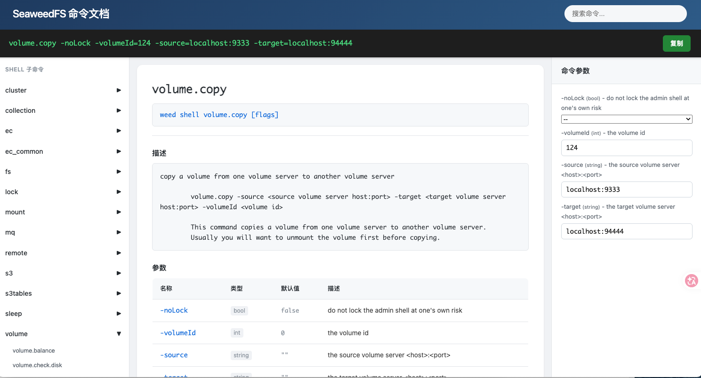

# SeaweedFS 命令文档浏览器

一个用于浏览 SeaweedFS 命令的 Web 界面。



## 快速部署

### 一键部署（推荐）

```bash
tar -xzvf seaweedfs-docs-deploy.tar.gz
chmod 755 start.sh
./start.sh
```

服务启动后访问 `http://服务器IP:3000`

### 自动化部署（从源码）

```bash
tar -xzvf seaweedfs-docs-*.tar.gz  # 解压源码包
chmod 755 deploy.sh
./deploy.sh
```

`deploy.sh` 会自动：
1. 检查并安装 Node.js（如需要）
2. 安装项目依赖
3. 从 GitHub 下载 SeaweedFS 最新代码
4. 提取命令文档
5. 构建并打包

### 手动部署

```bash
# 安装 Node.js（如未安装）
curl -fsSL https://rpm.nodesource.com/setup_20.x | sudo bash -
sudo yum install -y nodejs

# 启动服务
npx serve dist
```

## 开发

```bash
# 安装依赖
npm install

# 开发模式（热重载）
npm run dev

# 提取命令文档
npm run extract-docs

# 打包构建
npm run build
```

## 命令数据提取

默认从 GitHub 下载 SeaweedFS 最新代码并提取命令文档。

如需使用本地代码：

```bash
WEED_PATH=/path/to/local/seaweedfs npm run extract-docs
```

## 功能

- 查看主命令和 Shell 子命令
- 搜索过滤命令
- 命令参数构建
- 一键复制命令
- Shell 子命令折叠/展开
- 高亮显示搜索结果

## 目录结构

```
.
├── deploy.sh              # 自动化部署脚本
├── package.json           # 项目配置
├── vite.config.js        # Vite 配置
├── public/               # 静态资源源目录
│   └── docs/
│       └── commands.json # 提取的命令文档
├── scripts/
│   └── extract-docs.js   # 命令提取脚本
├── src/                  # 前端源码
│   ├── main.js
│   └── style.css
└── dist/                # 构建产物（部署用）
    ├── index.html
    ├── assets/
    ├── docs/
    └── start.sh
```

## 部署包结构

```
seaweedfs-docs-deploy.tar.gz
├── index.html
├── assets/
│   ├── *.css
│   └── *.js
├── docs/
│   └── commands.json
└── start.sh
```


# 原项目链接

https://github.com/seaweedfs/seaweedfs
